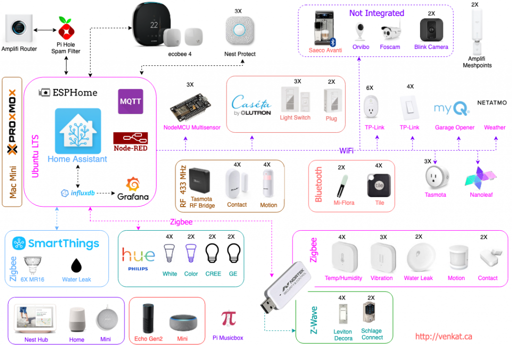

# Overview

Here is my household [Home Assistant](https://home-assistant)  configuration.  I try to keep this document update to truely reflect my Config backup at GitHub, but please bear with me for any inconsistencies. 

The published version of configruations is working with Integration Core Version: 0.109.6 in HassOS 3.13.  

I started using Home Assistant two years ago, so there may be some depreciated code/integration still lurking, will try to clean them up. 

I also write some extended configuration notes in my blog at [venkat.ca](http://venkat.ca/) 

Follow me on [GitHub](https://github.com/torvenkat) 

*Document last updated: 1 Nov  2021* 

